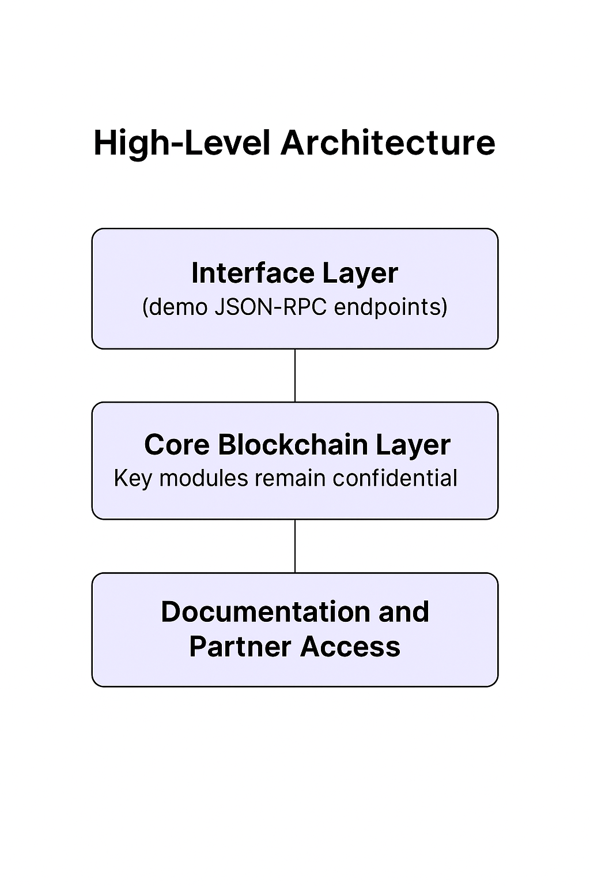

- [Architecture Snapshot (v0.2)](https://github.com/kaelitcom/kaelit-research/releases/tag/v0.2)
[📌 View the Initial Public Architecture Snapshot (v0.1)](https://github.com/kaelitcom/kaelit-research/releases/tag/v0.1)

# KAELIT Technical Overview (Demo)

This repository provides a high-level technical overview of the KAELIT project.
It is intended for demonstration purposes and does NOT contain any production-level or proprietary implementation details.

**Important Note:**
- This document summarizes the overall design and architecture of KAELIT.
- Core modules (e.g., the full blockchain engine, cryptographic algorithms, and consensus logic) are strictly confidential and are NOT disclosed here.
- For full technical details or partnership inquiries, please contact us at [https://kaelit.com](https://kaelit.com).

---

## Table of Contents
- [Overview](#overview)
- [High-Level Architecture](#high-level-architecture)
- [Interface and API Design](#interface-and-api-design)
- [Security Strategy](#security-strategy)
- [Future Enhancements](#future-enhancements)

## Overview
KAELIT is a next-generation blockchain project that integrates AI-driven optimization, post-quantum cryptographic solutions, and innovative distributed ledger technology. The project is designed to achieve high scalability, robust security, and efficient transaction processing through a modular architecture.

*Note: This overview is for public demonstration only.*

## High-Level Architecture
KAELIT's architecture is conceptually divided into three layers:
1. **Interface Layer:**  
   Exposes JSON-RPC endpoints (demo code available in the `kaelit-interface` repository) for client integrations.
2. **Core Blockchain Layer:**  
   Implements transaction processing, consensus, and cryptographic functions.  
   *Key components and proprietary modules remain confidential.*
3. **Documentation and Partner Access:**  
   Additional details and modules are maintained in closed repositories and shared only under NDA.

## KAELIT High-Level Architecture

## Interface and API Design
The public demo (kaelit-interface) illustrates the structure of our JSON-RPC interface, including:
- Retrieval of network information.
- Submission of transactions (demo implementation only).

These elements reflect the intended API style and integration approach without exposing any core processing logic.

## Security Strategy
- KAELIT employs a hybrid cryptographic approach combining traditional methods (e.g., ECDSA for compatibility) with advanced post-quantum signature schemes.
- All critical cryptographic functions and consensus algorithms are maintained as proprietary.
- This public overview intentionally omits any implementation details that could compromise technology security.

## Future Enhancements
We will continue updating this documentation with further architectural summaries, high-level diagrams, and strategic updates as the project matures.
- Expanded architectural diagrams.
- Summaries of consensus and parallel processing strategies.
- Detailed roadmaps for upcoming development phases.

**Confidential Note:** This document is intended solely for public demonstration. All core technical details are confidential and will only be disclosed under formal partnership agreements.

---

*Document Version:* 0.1-demo  
*Last Updated:* 2025.04.14
